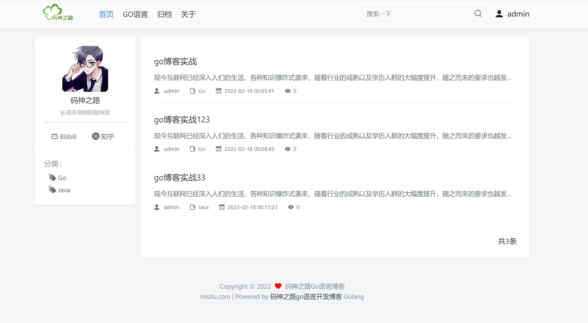

## 一、项目简介

最近看goweb与前端一个记事本插件时发现一个小项目。项目周期不长但是项目用的插件正好是自己想要的，所以以此练练手

Go博客实战教程，是一个练手级项目教程，使用原生Go开发，未使用任何框架。

**学习本项目能学到什么？**

* 如何使用原生Go开发一个web项目
* 循序渐进，掌握编程思维和思路
* 初步具有工程思维，能适应一般的开发工作



## 二、项目搭建

> 这里使用原生http包，当有请求发来的时候

### 1.监听端口，并将数据响应出去

main.go

````go
package main

import (
	"encoding/json"
	"log"
	"net/http"
)
//将对应结构体属性的名字对应的属性值映射成json字符串key所对应的值
type IndexData struct {
	Title string `json:"title"`
	Desc string `json:"desc"`
}
func index(w http.ResponseWriter,r *http.Request)  {
    //设置响应体类型
	w.Header().Set("Content-Type","application/json")
	//创建结构体对象
    var indexData IndexData
	indexData.Title = "码神之路go博客"
	indexData.Desc = "现在是入门教程"
    //将对象转换成json字符串格式字节流
	jsonStr,_ := json.Marshal(indexData)
    //响应出去
	w.Write(jsonStr)
}

func main()  {
	//程序入口，一个项目 只能有一个入口
	//web程序，http协议 ip port
	server := http.Server{
		Addr: "127.0.0.1:8080",
	}
    //制定路由映射
	http.HandleFunc("/",index)
    //开始监听
	if err := server.ListenAndServe();err != nil{
		log.Println(err)
	}
}
````

### 2.解析模板

index.html

````html
<!DOCTYPE html>
<html lang="en">
<head>
    <meta charset="UTF-8">
    <title>Title</title>
</head>
<body>
 hello mszlu blog!!
{{.Title}}
 {{.Desc}}
</body>
</html>
````

main.go

````go
func indexHtml(w http.ResponseWriter,r *http.Request)  {
    //初始化一个模板，并起一个名字index.html
	t := template.New("index.html")
    //获取当前工作路径
	viewPath, _ := os.Getwd()
    //解析模板
	t,_ = t.ParseFiles(viewPath + "/template/index.html")
	//创建要返回出去的对象
    var indexData IndexData
	indexData.Title = "码神之路go博客"
	indexData.Desc = "现在是入门教程"
    //将模板写入响应体
	err := t.Execute(w,indexData)
	fmt.Println(err)
}

func main()  {
	//程序入口，一个项目 只能有一个入口
	//web程序，http协议 ip port
	server := http.Server{
		Addr: "127.0.0.1:8080",
	}
	http.HandleFunc("/",index)
	http.HandleFunc("/index.html",indexHtml)
	if err := server.ListenAndServe();err != nil{
		log.Println(err)
	}
}
````

## 三、静态页面

### 1.核心处理器

````golang
//main.go
package main

import (
	"config"
	"html/template"
	"log"
	"models"
	"net/http"
	"time"
)

type IndexData struct {
	Title string `json:"title"`
	Desc  string `json:"desc"`
}

func IsODD(num int) bool {
	return num%2 == 0
}
func GetNextName(strs []string, index int) string {
	return strs[index+1]
}
func Date(layout string) string {
	return time.Now().Format(layout)
}
func index(w http.ResponseWriter, r *http.Request) {
	t := template.New("index.html")
	//1. 拿到当前的路径
	path := config.Cfg.System.CurrentDir
	//访问博客首页模板的时候，因为有多个模板的嵌套，解析文件的时候，需要将其涉及到的所有模板都进行解析
	home := path + "/template/home.html"
	header := path + "/template/layout/header.html"
	footer := path + "/template/layout/footer.html"
	personal := path + "/template/layout/personal.html"
	post := path + "/template/layout/post-list.html"
	pagination := path + "/template/layout/pagination.html"
	// 将方法映射到模板里面
	t.Funcs(template.FuncMap{"isODD": IsODD, "getNextName": GetNextName, "date": Date})
	// 解析一系列的模板
	t, err := t.ParseFiles(path+"/template/index.html", home, header, footer, personal, post, pagination)
	if err != nil {
		log.Println(err)
	}
	//页面上涉及到的所有的数据，必须有定义（这里将假数据放上去）
	var categorys = []models.Category{
		{
			Cid:  1,
			Name: "go",
		}, {
			Cid:  2,
			Name: "python",
		},
	}
	var posts = []models.PostMore{
		{
			Pid:          1,
			Title:        "Golang博客",
			Content:      "土拨鼠",
			UserName:     "码神",
			ViewCount:    123,
			CreateAt:     "2022-02-20",
			CategoryId:   1,
			CategoryName: "go",
			Type:         0,
		},
		{
			Pid:          2,
			Title:        "Python博客",
			Content:      "蟒蛇",
			UserName:     "码神",
			ViewCount:    123,
			CreateAt:     "2022-02-20",
			CategoryId:   1,
			CategoryName: "python",
			Type:         0,
		},
	}
	// 对页面信息进行进一步封装
	var hr = &models.HomeResponse{
		config.Cfg.Viewer,
		categorys,
		posts,
		1,
		3,
		[]int{1},
		true,
	}
	t.Execute(w, hr)
}

func main() {
	//程序入口，一个项目 只能有一个入口
	//web程序，http协议 ip port
	server := http.Server{
		Addr: "127.0.0.1:8080",
	}
	http.HandleFunc("/", index)
	// 将静态资源映射出去
	http.Handle("/resource/", http.StripPrefix("/resource/", http.FileServer(http.Dir("public/resource/"))))
	if err := server.ListenAndServe(); err != nil {
		log.Println(err)
	}
}

````

### 2. 配置文件

#### 1.config

对配置信息进行汇总，并通过配置文件进行初始化

````go
//config/config.go
package config

import (
	"fmt"
	"os"

	"github.com/BurntSushi/toml"
)

//*******************************************************************//
//**将信息提取出来的话需要修改App框架里面的内容可以直接修改toml配置文件***//
//*******************************************************************//

//信息的汇总用于管理整个系统框架
type TomlConfig struct {
	Viewer Viewer
	System SystemConfig
}

// 首页信息（配置项需要展示的东西）
type Viewer struct {
	Title       string
	Description string
	Logo        string
	Navigation  []string
	Bilibili    string
	Avatar      string
	UserName    string
	UserDesc    string
}

// 系统配置
type SystemConfig struct {
	AppName         string
	Version         float32
	CurrentDir      string
	CdnURL          string
	QiniuAccessKey  string
	QiniuSecretKey  string
	Valine          bool
	ValineAppid     string
	ValineAppkey    string
	ValineServerURL string
}

var Cfg *TomlConfig

func init() {
	Cfg = new(TomlConfig)
	var err error
	Cfg.System.CurrentDir, err = os.Getwd()
	if err != nil {
		panic(err)
	}
	Cfg.System.AppName = "godemo01"
	Cfg.System.Version = 1.0
	fmt.Println(Cfg.System.CurrentDir)
	_, err = toml.DecodeFile(Cfg.System.CurrentDir+"\\vendor\\config\\config.toml", &Cfg)
	if err != nil {
		panic(err)
	}
}

````

配置文件toml

配置信息（这里是要展示在页面的静态信息）

//config/config.toml

````toml
[viewer]
    Title = "码神之路Go语言博客"
    Description = "码神之路Go语言博客"
    Logo = "/resource/images/logo.png"
    Navigation = ["首页","/", "GO语言","/golang", "归档","/pigeonhole", "关于","/about"]
    Bilibili = "https://space.bilibili.com/473844125"
    Zhihu = "https://www.zhihu.com/people/ma-shen-zhi-lu"
    Avatar = "https://gimg2.baidu.com/image_search/src=http%3A%2F%2Finews.gtimg.com%2Fnewsapp_bt%2F0%2F13147603927%2F1000.jpg&refer=http%3A%2F%2Finews.gtimg.com&app=2002&size=f9999,10000&q=a80&n=0&g=0n&fmt=jpeg?sec=1647242040&t=c6108010ed46b4acebe18955acdd2d24"
    UserName = "码神之路"
    UserDesc = "长得非常帅的程序员"
[system]
    CdnURL = "https://static.mszlu.com/goblog/es6/md-assets"
    QiniuAccessKey = "替换自己的"
    QiniuSecretKey = "替换自己的"
    Valine = true
    ValineAppid = "替换自己的"
    ValineAppkey = "替换自己的"
    ValineServerURL = "替换自己的"
````


#### 2.models

页签信息

````go
//models/category.go
package models

//页签信息
type Category struct {
	Cid      int    //页签id
	Name     string //页签名称
	CreateAt string //创建时间
	UpdateAt string //更新时间
}

````


页面总信息（页面的布局，以及后期添加上的信息）

````go
//models/home.go
package models

import "config"

//页面总信息
type HomeResponse struct {
	config.Viewer            //要展示的配置项
	Categorys     []Category //博客列表
	Posts         []PostMore //分页
	Total         int        //总数
	Page          int        //当前页数
	Pages         []int      //总的
	PageEnd       bool       //最后一页
}

````

博客信息

````go
//models/post.go
package models

import (
	"config"
	"html/template"
	"time"
)

type Post struct {
	Pid        int       `json:"pid"`        // 文章ID
	Title      string    `json:"title"`      // 文章ID
	Slug       string    `json:"slug"`       // 自定也页面 path
	Content    string    `json:"content"`    // 文章的html
	Markdown   string    `json:"markdown"`   // 文章的Markdown
	CategoryId int       `json:"categoryId"` //分类id
	UserId     int       `json:"userId"`     //用户id
	ViewCount  int       `json:"viewCount"`  //查看次数
	Type       int       `json:"type"`       //文章类型 0 普通，1 自定义文章
	CreateAt   time.Time `json:"createAt"`   // 创建时间
	UpdateAt   time.Time `json:"updateAt"`   // 更新时间
}

type PostMore struct {
	Pid          int           `json:"pid"`          // 文章ID
	Title        string        `json:"title"`        // 文章ID
	Slug         string        `json:"slug"`         // 自定也页面 path
	Content      template.HTML `json:"content"`      // 文章的html
	CategoryId   int           `json:"categoryId"`   // 文章的Markdown
	CategoryName string        `json:"categoryName"` // 分类名
	UserId       int           `json:"userId"`       // 用户id
	UserName     string        `json:"userName"`     // 用户名
	ViewCount    int           `json:"viewCount"`    // 查看次数
	Type         int           `json:"type"`         // 文章类型 0 普通，1 自定义文章
	CreateAt     string        `json:"createAt"`
	UpdateAt     string        `json:"updateAt"`
}

type PostReq struct {
	Pid        int    `json:"pid"`
	Title      string `json:"title"`
	Slug       string `json:"slug"`
	Content    string `json:"content"`
	Markdown   string `json:"markdown"`
	CategoryId int    `json:"categoryId"`
	UserId     int    `json:"userId"`
	Type       int    `json:"type"`
}

type SearchResp struct {
	Pid   int    `orm:"pid" json:"pid"` // 文章ID
	Title string `orm:"title" json:"title"`
}

type PostRes struct {
	config.Viewer
	config.SystemConfig
	Article PostMore
}

````


## 四、至此

至此基本的数据封装已经实现了，可以看到核心处理器中的模板解析代码是在处理器函数内的，如果在这里进行解析的话可能会导致性能下降

可以将模板路由解析这些操作再封装起来，然后在合适的时机进行并行计算。以提高计算速度。
